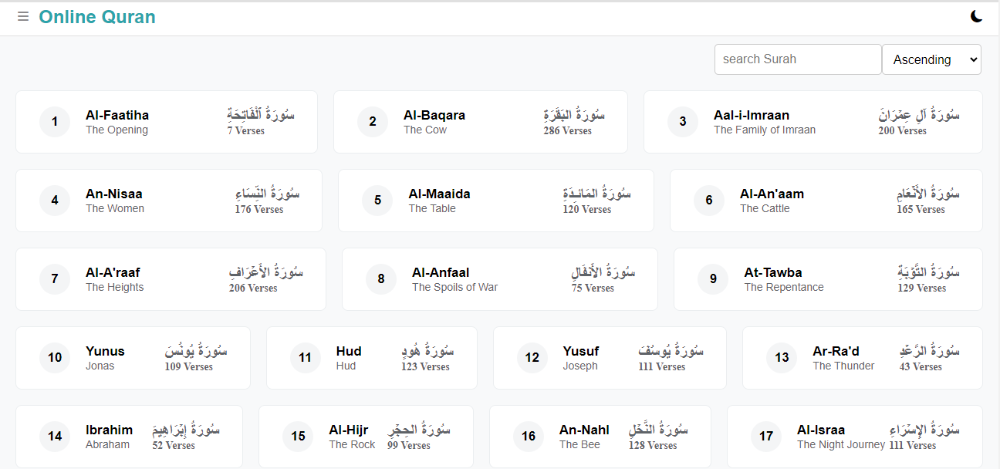
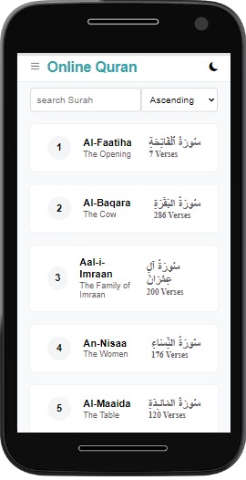
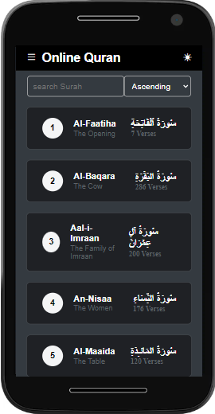
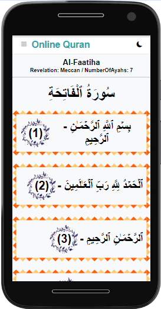

# Online Quran  
This is a simple online Quran that  We can see surah List and read individual surah by clicking surah name.

## Tools
- HTML
- CSS
- JavaScript

## Features
- Surah List
- Read individual surah (Dynamic Single page only Vanila js)
- Searching by Surah name
- Order in Ascending and Descending
- set URL params when searching and ordering
- Dark Mode
- Scroll Indicator

## Screenshot

## Live Demo
[Live Demo](https://abdurraahimm.github.io/online-quran/?order=asc)

## How to use
1. Clone the repository or download it as zip file.
2. Unzip and Open folder in Vs Code.
3. and run live server.
4. open browser and go to http://localhost:5502 
3. Enjoy it.

## Author
- Github: [@AbdurRahim](https://github.com/AbdurRaahimm)
- Linkedin: [@AbdurRahim](https://www.linkedin.com/in/abdur-rahim4g/)
- Twitter: [@AbdurRahim](https://twitter.com/AbdurRahim4G)

Inspired from [Quran.com](https://quran.com)

